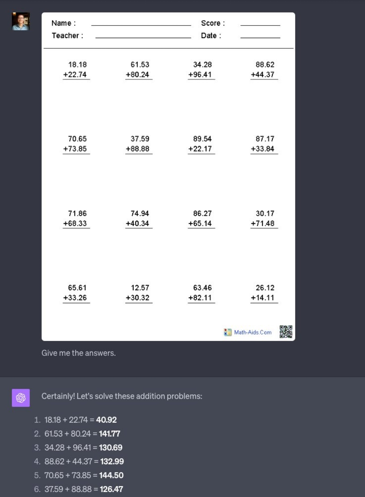
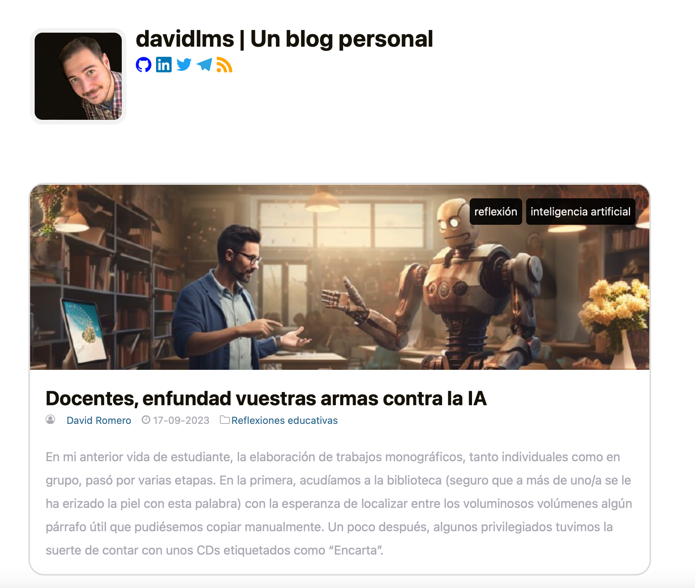
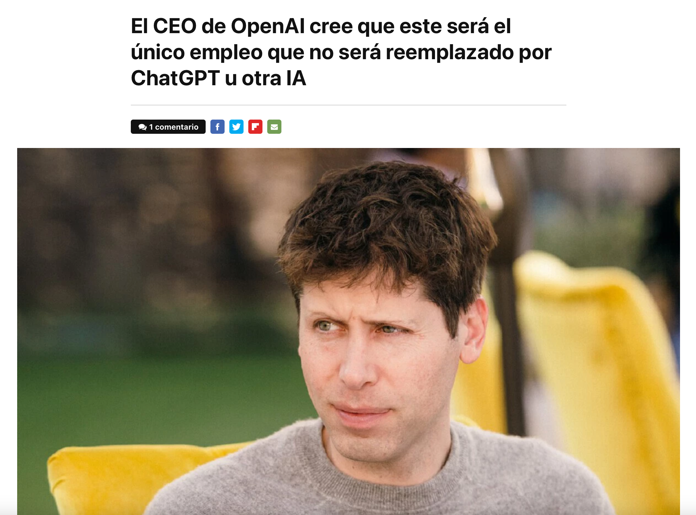

<h2 class="r-fit-text" style="text-align: center"> Modelos de lenguaje en educación </h2>

---
## ¿Qué ha pasado en los dos últimos años?

Disrupción en tecnologías de creación de contenido basadas en IA

Imagen, audio, vídeo, 3D y texto <!-- .element: class="fragment" -->

De GPT-3 (2020) a GPT-3.5 (ChatGPT, 30 de noviembre de 2022) <!-- .element: class="fragment" -->
---
## ¿Qué es un LLM?

Large Language Model

Del Machine Learning al Deep Learning <!-- .element: class="fragment" -->

## GPT

Objetivo: Completar texto <!-- .element: class="fragment" -->

Objetivos intermedios: traducción, generación de código de programación... (puede ser peligroso)<!-- .element: class="fragment" -->

Alucinaciones y cadenas de pensamiento <!-- .element: class="fragment" -->

Mejor con contexto <!-- .element: class="fragment" -->

Posibilidad de fine-tuning (reentrenamiento) <!-- .element: class="fragment" -->

## La analogía del estudiante

Fase de estudio (entrenamiento)

Una petición es un examen (no recuerda exámenes anteriores) <!-- .element: class="fragment" -->

Puede tratar de responder lo que no sabe (alucinaciones) <!-- .element: class="fragment" -->

Le puedes dar pistas en el enunciado (contexto), pero su longitud es limitada (número de tokens) <!-- .element: class="fragment" -->

Puede volver a la habitación y centrarse en un tema concreto (fine-tuning) <!-- .element: class="fragment" -->

## ¿Qué pasa si se le dan herramientas al estudiante?
---
## ¿Qué ha pasado desde la salida de ChatGPT?

Explosión de nuevas herramientas:

Bing Chat (Microsoft) <!-- .element: class="fragment" -->

Office Copilot (Microsoft) <!-- .element: class="fragment" -->

ChatGPT Plugins (OpenAI) <!-- .element: class="fragment" -->

Herramientas de terceros <!-- .element: class="fragment" -->

## GPT-4 (14 de marzo)

[Capacidades y comparativa](https://openai.com/product/gpt-4) <!-- .element: class="fragment" -->

Solamente accesible usando la suscripción (y de forma limitada) <!-- .element: class="fragment" -->

Características: Modelo más potente, puede responder sobre imágenes, tools (búsqueda en Internet, ejecución de código, generación de imágenes y acceso a plugins de terceros)<!-- .element: class="fragment" -->

Actualización prácticamente automática de las herramientas anteriores <!-- .element: class="fragment" -->

## Agentes autónomos

Auto-GPT <!-- .element: class="fragment" -->

Generative Agents: Interactive Simulacra of Human Behavior <!-- .element: class="fragment" -->
---
## ¿Qué cambia esto en educación?

Cambia todo, no solo en educación

Nuevo reto y en búsqueda de nuevas soluciones <!-- .element: class="fragment" -->

El crecimiento está siendo exponencial <!-- .element: class="fragment" -->

No es fácil de detectar su uso <!-- .element: class="fragment" -->

## ¿Tienen sentido las tareas?

<small>Fuente: https://twitter.com/petergyang/status/1707119323729580416¡</small>

<video width="300" src="../assets/chatgpt-cell.mp4" controls></video>

<small>Fuente: https://twitter.com/mckaywrigley/status/1707408491110080602</small>

<small>https://davidlms.com</small>

## Ejemplos de uso

Conversaciones que te hacen ser más productivo <!-- .element: class="fragment" -->

Herramientas temporales útiles <!-- .element: class="fragment" -->

## ¿Acabará la IA con la docencia?

<small>Fuente: https://www.genbeta.com/actualidad/ceo-openai-cree-que-este-sera-unico-empleo-que-no-sera-reemplazado-chatgpt-u-otra-ia</small>
---
<!-- .slide: data-background-video="../assets/searching.mp4" data-background-opacity="0.6" data-background-video-loop data-background-video-muted-->
<!-- .slide: data-background-video="../assets/searching.mp4" data-background-opacity="0.6" data-background-video-loop data-background-video-muted-->

## ¿Dudas?
